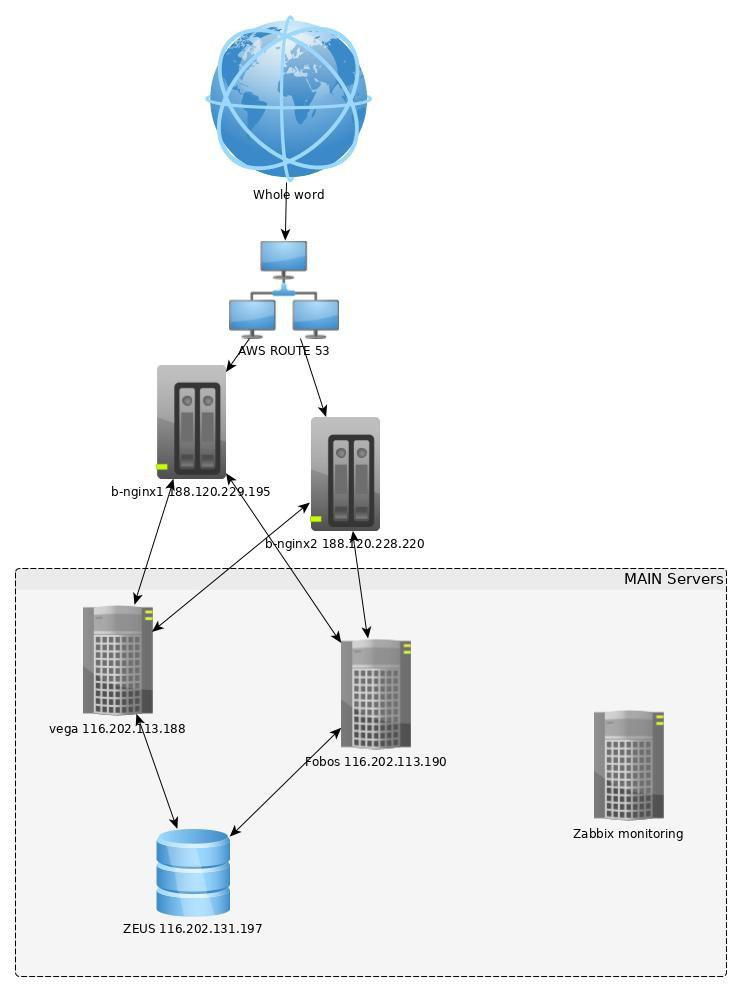

# CQRS

[Описание схемы работы](files/description.pdf)

### Описание схемы 

* **Input nginx** - точка входа для всего проекта. Эти сервера обеспечивают быструю выдачу, так как близко находятся к клиентам. Так же, помимо кэша, туда можно было бы положить картинки, при достаточном количестве доступного дискового пространства. Для обхождения запретов, эти прокси должны иметь 1 IPv4 и 1 IPv6. В DNS указываем только IPv4, а по IPv6 соединяемся с серверами WEB 01-PROD и WEB 02 PROD (fobos & vega), на которых лежит база только для чтения и осуществляется выдача контента для Input NGINX.

* **MAIN Database** (server (zeus)) - основная нагрузка и все изменения, там же крутится CRON. Возможно что на нём будет работать склад. 

* **WEB 01-PROD и WEB 02 PROD (fobos & vega)** - сервера, на которых лежат базы только для чтения и осуществляется выдача контента для Input NGINX.

* **Stage for prePROD** - это машина для AB тестирования. Её можно указывать на Input Nginx в качестве третьего сервера с очень маленьким весом и часть клиентов будет использовать новые фишки, типа 2-3% и то случайным образом. Разумеется это только для тестирования и не для постоянной работы.

* **Сервер мониторинга** - zabbix [https://zabbix.example.com/screens.php?ddreset=1](https://zabbix.example.com/screens.php?ddreset=1)

